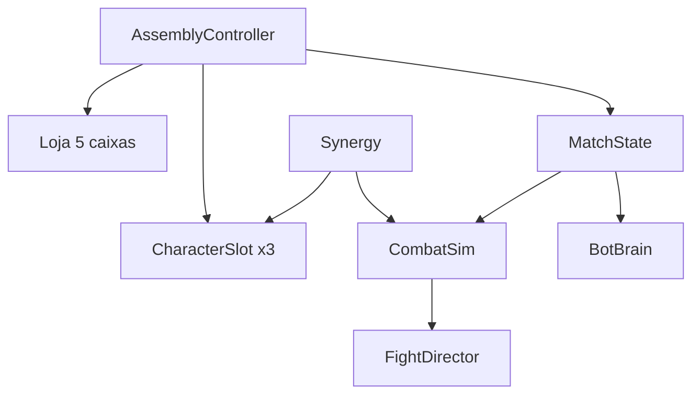

# Arquitetura

Como o programa está organizado por dentro (visão simples).

## Em uma frase

Há **uma tela principal**. As **regras da partida** (loja, sinergia, luta) ficam em código puro; a tela só **mostra** o que aconteceu.

## Camadas

```
Tela (cenas .tscn)
    ↓
Controladores / HUD (assembly + ui)
    ↓
Regras da partida (scripts/match)
    ↓
Dados (PartDef, CharacterDef, CompositeResolver)
    ↓
Arte e recursos (assets/, data/)
```

## Peças principais

| Peça | Papel |
|------|--------|
| `AssemblyController` | Maestro: prep ↔ luta, loja, cartas |
| `MatchState` | Rodada, HP, pancadas, bots, pareamento |
| `CombatSim` | Calcula a luta e devolve uma lista de eventos |
| `Synergy` | 100% / 75% / 50% na mesma carta |
| `ShopPool` / `BotBrain` | Sorteio da loja e compras dos bots. A loja lê todas as fichas `*_character.tres` |
| `FightDirector` / `FighterPuppet` / `FightPlaque` | Mostra o palco: pulo, caminhada, choque, KO |
| `PrepHud` / `ShopBar` / `StatTag` | PREP, pancadas, tags coloridas |
| `DragDropService` | Arraste de peça, troca de carta, vender |
| `Crate` / `PartView` / `CharacterSlot` | Caixa, peça, carta |
| `CompositeResolver` | Cola as peças pelos ímãs |

## Organização dos scripts

| Pasta | Responsabilidade |
|-------|------------------|
| `scripts/assembly/` | Tela: cartas, caixas, luta visível |
| `scripts/match/` | Regras (podem ser testadas sem abrir o jogo) |
| `scripts/data/` | Definições de peças e composição visual |
| `scripts/ui/` | HUD, tags, cores |
| `scripts/core/` | Scripts de verificação |

## Padrões usados

- **Dados em Resource** (`.tres`): fichas editáveis no Godot.
- **Cenas instanciadas**: carta, caixa, peça.
- **Sinais**: “PRONTO”, “atualizar”, “peça vendida”.
- **Lógica pura** em `CombatSim` e `Synergy`: a animação não inventa o resultado.

## O que ainda não há na arquitetura

- Rede / multiplayer
- Troca de cenas (menu, etc.)

## Diagrama simples


