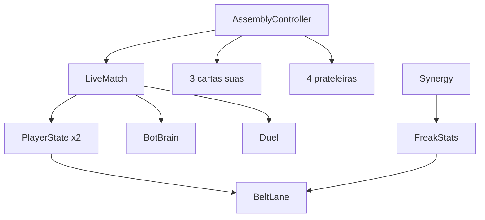

# Arquitetura

Como o programa está organizado por dentro (visão simples).

## Em uma frase

Há **uma tela principal**. As **regras da partida** (dinheiro, fases, esteira, luta) ficam em código puro; a tela só **mostra** o que aconteceu.

## Camadas

```
Tela (cenas .tscn)
    ↓
Controladores / HUD (assembly + ui)
    ↓
Regras da partida (scripts/match)
    ↓
Dados (PartDef, CharacterDef, CompositeResolver)
    ↓
Arte e recursos (assets/, data/)
```

## Peças principais

| Peça | Papel |
|------|--------|
| `AssemblyController` | Maestro: loja, cartas, esteiras, animações, troca das duas telas |
| `LiveMatch` | Fases da rodada: preparação 60s, luta, dano na vida, fim |
| `PlayerState` | Carteira, vida, loja, 3 cartas e esteira de **um** lado (você ou o bot) |
| `BeltLane` | Até 3 Freaks remando até a ponta (5 remadas) |
| `Duel` | Contas de um troca-troca de golpes |
| `FreakStats` / `Synergy` | Ataque, HP já com o bônus de tipo; Poder se o set fechou |
| `ShopPool` / `BotBrain` | Sorteio da loja e o oponente comprando no mesmo relógio |
| `BeltFreak` / `FlyingHead` | Desenho do Freak na esteira e a cabeça que voa |
| `MoneyBar` / `ActionBar` / `SideHpBar` / `PrepClock` | Dinheiro, botões, vida acima da esteira, relógio 60s |
| `DragDropService` | Arraste de peça, soltar na carta (e pagar), vender |
| `PartView` / `CharacterSlot` / `ShopShelf` | Peça, carta, prateleira |
| `CompositeResolver` / `PartKit` | Cola cabeça e braços no tronco; o tronco encaixa no caixote (faixa atrás, caixa na frente) |

## Organização dos scripts

| Pasta | Responsabilidade |
|-------|------------------|
| `scripts/assembly/` | Tela: cartas, peças, esteira visível |
| `scripts/match/` | Regras (podem ser testadas sem abrir o jogo) |
| `scripts/data/` | Definições de peças e composição visual |
| `scripts/ui/` | HUD, tags, cores |
| `scripts/core/` | Scripts de verificação, importar, editar e apagar o elenco |

## Padrões usados

- **Dados em Resource** (`.tres`): fichas editáveis no Godot.
- **Cenas instanciadas**: carta, peça.
- **Sinais**: “loja sorteada”, “Freak lançado”, “fase mudou”. Um sinal é um aviso de que algo aconteceu, sem a outra parte ficar perguntando o tempo todo.
- **Lógica pura** em `Duel` e `Synergy`: a animação não inventa o resultado.

## O que ainda não há na arquitetura

- Rede / multiplayer
- Troca de cenas (menu, etc.)

## Diagrama simples


