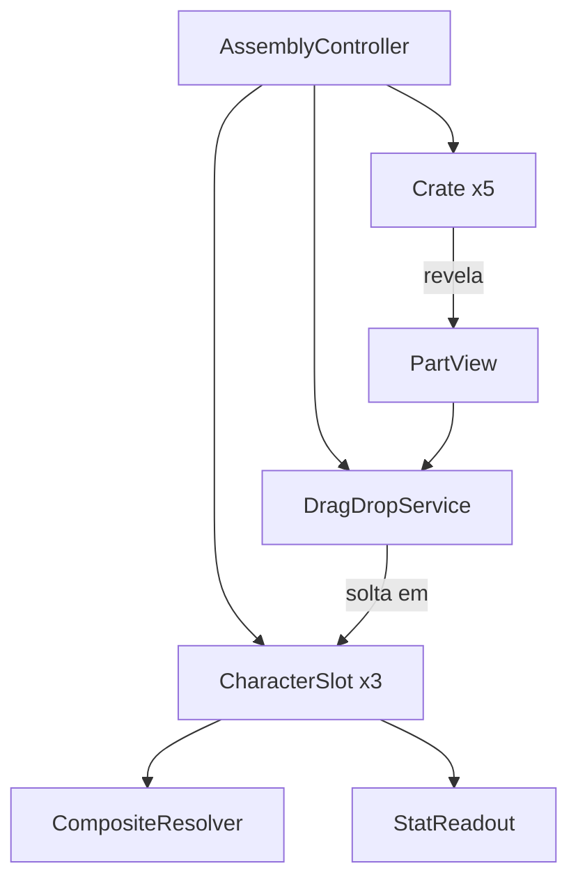

# Arquitetura

Como o programa está organizado por dentro (visão simples).

## Em uma frase

Há **uma tela principal** (montagem). Um controlador sobe as cartas e as caixas; um serviço cuida do arrastar e soltar; os dados dos personagens ficam em arquivos de recurso (`.tres`).

## Camadas

```
Tela (cenas .tscn)
    ↓
Controladores / serviços (scripts de assembly e UI)
    ↓
Dados (PartDef, CharacterDef, CompositeResolver)
    ↓
Arte e recursos (assets/, data/)
```

## Peças principais

| Peça | Papel |
|------|--------|
| `AssemblyController` | Orquestra a tela: cartas, caixas, arraste e o botão LUTAR |
| `DragDropService` | Estado do arraste: quem está sendo arrastado, onde pode soltar |
| `FightDirector` / `FighterPuppet` | Animação solo de luta no shelf (sem oponente ainda) |
| `Crate` | Caixa com 2 cliques (3 sprites) que some e revela uma `PartView` |
| `PartView` | Peça arrastável na prateleira / carta |
| `CharacterSlot` | Carta com zonas de cabeça/tronco/pernas, visual e atributos |
| `CompositeResolver` | Posiciona cabeça/tronco/pernas colando pelos ímãs |
| `StatReadout` / `BackgroundFX` | HUD de atributos e fundo |
| `Sfx` (autoload) | Toca efeitos sonoros curtos |

## Organização dos scripts

| Pasta | Responsabilidade |
|-------|------------------|
| `scripts/assembly/` | Jogabilidade da montagem |
| `scripts/data/` | Definições de dados e lógica pura de composição |
| `scripts/ui/` | Interface e efeitos visuais |
| `scripts/core/` | Utilitários (pool) e scripts de verificação |
| `scripts/preview/` | Cenas de teste (hoje: pernas 3D andando) |

## Padrões usados

- **Dados em Resource** (`.tres`): como “fichas” editáveis no Godot, sem hardcode de tudo no código.
- **Cenas instanciadas**: `CharacterSlot`, `Crate`, `PartView` são cenas reutilizáveis.
- **Sinais** (signals): eventos como “caixa quebrou” ou “peça encaixou”, para as partes se falarem sem ficarem grudadas.
- **Serviço no grupo** `drag_drop_service`: a peça encontra o serviço de arraste pelo grupo.
- **Lógica pura** em `CompositeResolver` (`RefCounted`): não depende da tela; só devolve um plano de exibição.

## O que ainda não há na arquitetura

- Autoloads / singletons globais de jogo
- Gerenciador de cenas (só existe a cena principal)
- Rede / multiplayer
- Camada de combate

## Diagrama simples


